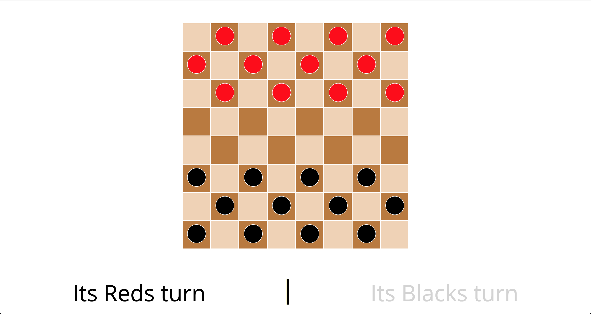
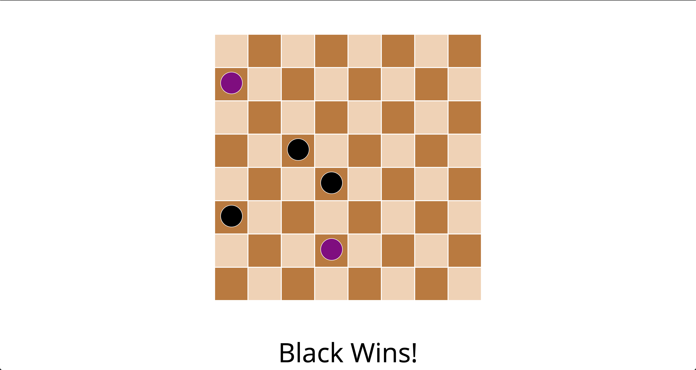

# Checkers
Checkers is a classic board game with several variations, but the most commonly played version is standard Checkers on an 8x8 board, with 12 checkers per player.

### Checkers Strategy

  * Always diagonally double up your checkers so they cannot be jumped.
  * Get your checkers kinged as soon as possible, as this will allow them to move freely around the board.
  * Select a two-person Checkers game to play with a friend or family!
  
### License
Copyright @ 2022 All Right Reserved By Poornima Kavishka Prabath

### Screenshots:

